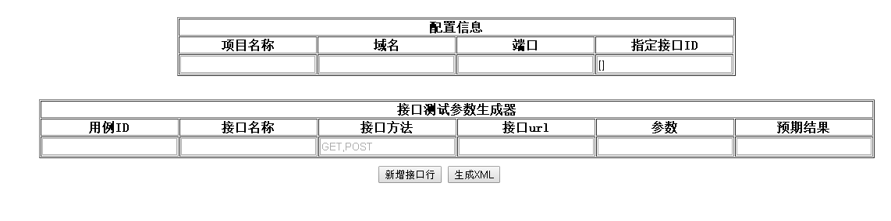
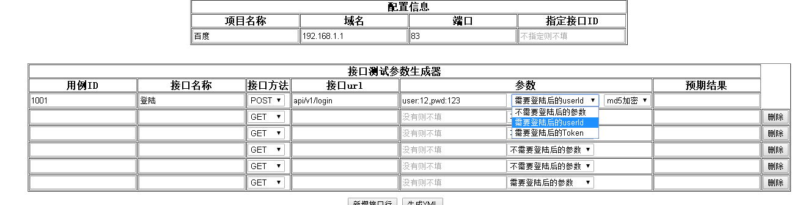

#js保存xml,txt文件到本地

* 主要是参考：https://github.com/eligrey/FileSaver.js

* 主要用于在线生成接口xml然后给其他语言解析。[我的接口自动化平台](https://github.com/284772894/autoHttpApiTest)

### 2016-1-10 更新日志

##2016-1-12 更新历史
* 接口生成器改成支持生成域名，接口产生，只要生成一次就可以了

### 2016-1-16 更新日志
* 非必填内容可不填

### 2016-1-23 更新日志
* 主要更新登陆接口返回userid,或者token给其他接口的生成
* 下拉操作

* 更新说明文档 请参考[说明文档](https://github.com/284772894/SaveXML/blob/master/remark.md)
