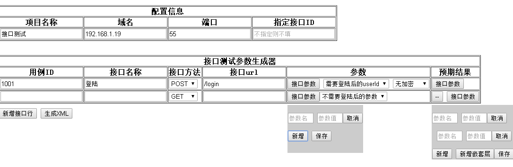

#文档说明

* 项目名称:必填.如：百度接口测试
* 域名：必填.如：192.168.1.2
* 端口：必填.如：12
* 指定接口：非必填.如果填，就是只是测试指定的用例ID接口,格式为：1001,1002(多个id,用英文逗号隔开)
* 生成器第一行主要是用于登陆接口，其中包含登陆后返回的是userid还是token值给他们接口使用，还有加密方式（这里待完善）
* 生成器第二行以后的参数解释
	* 用例ID:必填.如：1001
	* 接口名称:必填.对接口的描述，如：登陆
	* 接口方法:必选,现在常用的方法为：GET,POST
	* 接口url:必填.如：api/v0.1/list.
	* 参数：
		* 接口的参数，非必填，在弹出层中输入
		* 是否需要登陆后的参数，参考登陆后返回的参数现在，支持userid,token
		* 生成器第一行预留给登陆接口
	* 预期结果：必填.在弹出层中输入如，只支持一级嵌套。嵌套层的key现在写死的为Data.
		* 比如返回的结果为：{data:[{name:1,pwd:1,id:1},{name:2:pwd:2,id:2}]，success:1},那么你的预期结果里面的就应该新增一个这样的嵌套数据
		name=1,pwd=2,id=3.实际接口测试中的检查点和实际结果对比：第一次对比success，第二次对比嵌套层里面的key
		* 预期结果的固定字段要和开发定义好，如success,嵌套层，嵌套key

