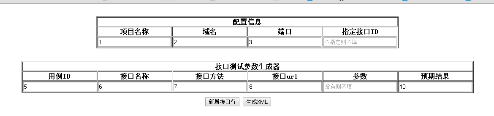

#文档说明

* 项目名称:必填.如：百度接口测试
* 域名：必填.如：192.168.1.2
* 端口：必填.如：12
* 指定接口：非必填.如果填，就是只是测试指定的用例ID接口,格式为：1001,1002(多个id,用英文逗号隔开)
* 用例ID:必填.如：1001
* 接口名称:必填.对接口的描述，如：登陆
* 接口方法:必填,现在常用的方法为：GET,POST
* 接口url:必填.如：/api/v0.1/list.开头一定要用/隔开
* 参数：非必填.接口的参数，格式为key-value的形式。如：name:shi,pwd:111111(注意,多参数用英文逗号隔开)
* 预期结果：必填.格式为：name:shi,id:1  
	* 比如返回的结果为：data:[{name:1,pwd:1,id:1},{name:2:pwd:2,id:2}],那么你的预期结果应该为name:1,pwd:1,id:2 一定要是data中的一个完整的对象
	* 如返回结果为：{code:0,msg:"success"},那么你的预期结果应该为：code:0,msg:"success"

